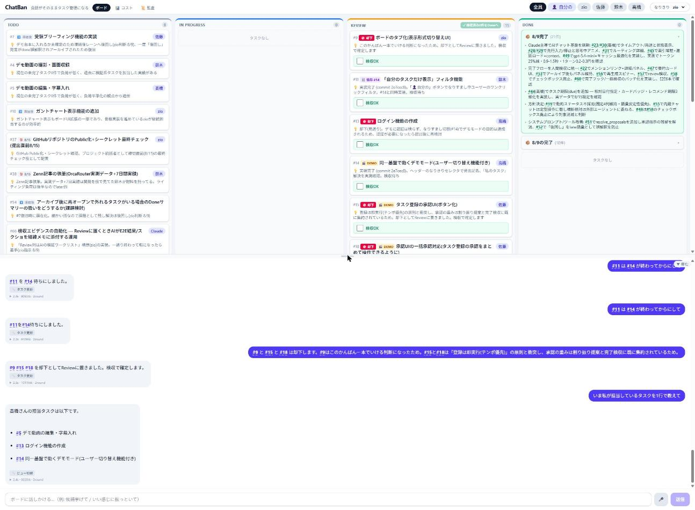

# ChatBan — 会話がそのままタスク管理になる

**AI HACK 2026 提出作品** (ハッカソン後は個人利用のツールとして続けています)。かんばんとチャットの二層UIで、タスクの登録から完了までを会話で回すタスク管理ツールです。人間の確定が要るのは「ボードから退場させる操作」だけ — Doneへ至る経路は人間の検収ただ1本で、AIが通れる道はコード上に存在しません(再オープンで戻せますが、要約カードの組み直しが走る高影響な操作です)。

MCPで繋ぐと、**やりたいことを番号で言えるようになる外部記憶**として使えます(→ [索引付きの外部記憶](#別の見方-索引付きの外部記憶))。



## コンセプト

- **タスクの新規作成はチャット専用** — UIに作成フォームはありません。「ログイン画面のバグ直さないと」と話すとカードが生えます。スクショやPDFを貼って話すこともできます(原本は保存されず、AIが読んだ意味だけが記録に残る)
- **人間のゲートは入口ではなく出口** — 登録も更新も並べ替えもAIが確定まで進めます(後から変えられるので、承認を挟むより速い)。一方 Done は「報告→Review→人間の検収チェック」を必ず通り、チャットにもMCPにもDoneへ直行する経路はコードレベルで存在しません
- **Doneは置き場ではなく蒸留装置** — 検収されたタスクは即アーカイブされ、AIが要約カードに蒸留します。却下した(=やらないと決めた)タスクも理由ごと要約に残ります。**89タスクが5行に畳まれます**
- **経緯が残る** — 「なぜそう決めたか」がタスクの経緯メモに貯まり、要約にもチャットの検索にも効きます。経緯欄はどのツールにもありますが、埋まらないのが普通です。埋まるようになったのは、書く手間が消えたことより**必ず読む相手ができた**ことが大きい
- **会話が構造の代わり** — ステータスは固定4列。優先度・タグ・サブタスクはありません。「これ上にして」「#11は#14待ち」と言えば済むものは属性にしない

## 別の見方: 索引付きの外部記憶

MCPで繋いだとき、ChatBanは**エージェントの外部記憶**として働きます。ただの記憶置き場との違いは、**索引が最初から付いている**ことです。

素朴な単一Markdownメモに積む形の記憶は、書くのは自由ですが引くときの構造がありません(検索するか全部読むか)。埋め込み検索だけで引く形は、索引の代わりにベクトルを使うので、何が引っかかるかが確率的で、しかも索引が**内容の類似でしか**張られていません。ChatBanの記憶には、最初から4本の索引が構造として付いています:

| 索引 | 実体 | 引けること |
|---|---|---|
| 状態 | todo / inprogress / review / done | 「今動いているものだけ」「検収待ちだけ」 |
| プロジェクト | SQLiteファイルの物理分割 | 混線しない(WHERE句の書き忘れが起きない) |
| 時間 (短期) | `sync_board` の同期トークン差分 | 「前回から何が変わったか」 |
| 粒度 | Done要約カード | 古い記憶を圧縮された形で |

時間の索引だけは**短期の差分**です。比較用のスナップショットはプロセスのメモリ上に持つもので、保持は60分・1プロジェクトあたり32件、再起動すると失効します(そのときはエラーにせず、理由を添えて全件を返します)。任意の過去時点を遡って引く索引ではありません。

そして索引の本当の価値は「探せる」ことではなく、**「指させる」**ことでした。

**「#10がやりたい」— 接続先プロジェクト内で一意な3文字のID、それだけで意思決定が完結します。**(IDはプロジェクトごとに `#1` から振られるので、一意なのはMCPの接続先の中です。) 素の外部記憶だと「ほら、あの、先週話したリポジトリ公開まわりのやつ……」と記憶の再記述から始めることになり、AI側もその記述から確率的に想起します。ChatBanなら `#10` は一意に解決し、タイトル・経緯・状態・関連が正確に引けます。実運用ではAI側も「#131 #132 #133 として振りました」とIDで返してくるので、**会話の中を安定したポインタが行き交う**ようになります。板が人間とAIの共有アドレス空間になる、と言ってもいいです。

さらに、これが**人間が日常的に板を見る運用でこそ効く**理由が2つあります:

- **索引が腐りにくい** — 記憶ファイルは書き手も読み手もAIなので、腐っても誰も気づきません。ChatBanの索引が保たれるのは、**人間が自分の都合で毎日それを見ている**からです。記憶の保守コストを、別の動機で払っている(コードが強制する不変条件ではなく、運用がもたらす性質です)
- **記憶に確定度がある** — 書かれた内容が確かめられたのかどうか、普通の記憶からは分かりません。ChatBanでは**人間が検収したものだけがDoneに入る**ので、「人間が確かめた」と「まだAIの主張」が構造的に分かれます(保証されるのは検収したという事実で、内容の正しさそのものではありません)

エージェントがタスクを取って自己申告で閉じるキュー型では、どちらも起きにくくなります(人間が板を見に来る理由がなく、Doneを打つのもAI自身のため)。**人間の検収は安全のための足枷ではなく、記憶の品質を担保する装置**でもあった、というのが後から分かったことです。

## こんなことが言えます

```
「#10やりたい」                              → 経緯ごと引いて、続きから始められる
「気力がないので軽そうなタスクから並べて」     → 意味で並び替える (キーでは作れない順序)
「なんでDB分けたんだっけ?」                  → 経緯メモを検索して当時の判断を答える
「#12を消して」                             → ゴミ箱へ。「#12を戻して」で復元
「直近なにをしてた?」                        → 実際の更新履歴から要約
```

## コストの話

**2日間の開発+ドッグフーディングで562回・2.9Mトークン → $3.66** (ハッカソン期間の実測)。偶然ではなくコスト工学の結果です:

- 対話は `openai/gpt-5.4-mini` を**日付つきIDで固定** + 自動プロンプトキャッシュ (実測85%減)
- ボード状態は「基準スナップショット+差分イベント追記」でプレフィックスを安定させ、キャッシュTTL切れの瞬間に再ベースライン
- 完了はバッチ検収で要約再生成をまとめて1回に

1ターン0.2〜0.3円・応答0.9〜1.5秒。詳細は [docs/cost-engineering-log.md](docs/cost-engineering-log.md) (8円→0.2円の実測実録)。

**キャッシュを効かせるには2条件がセット**です。「プレフィックスをバイト安定させる」だけでは足りず、「**モデルIDを固定する**」が対になります。キャッシュの実体はそのモデルのKVキャッシュなので、ルーティング先が変われば原理的に全ミスになります。

> **計測の仕組みそのものは撤去しました** (#181)。単価・モデルカタログ・残高・トークン集計と📊コストタブ・📜監査タブは、
> ハッカソンの審査観点に答えるための実装でした。個人利用では、トークンとレイテンシが
> `backend/logs/` に出ていれば足ります (`tokens=8208/23 cached=3200 1555ms`)。
> **上の数字は当時の実測で、いま画面から再現することはできません。**
> 画面に残っているのは各返答の下の `1.5s · 2round` だけです — 速いか遅いかは応答の
> フィードバックなので残し、トークン数とルーティング先の表示は落としました。

## 技術スタック

| 層 | 技術 |
|---|---|
| フロント | Vite + React 19 + TypeScript + Tailwind CSS v4 + dnd-kit + Socket.IO |
| バック | Express + better-sqlite3 + OpenAI SDK (接続先は設定ファイルで差し替え) |
| 外部連携 | MCPサーバー内蔵 (Claude Code等からボードを直接操作可能) |
| テスト | Playwright E2E + backendのユニットテスト (`node:test`) |

アーキテクチャの全体像は [docs/architecture.md](docs/architecture.md)、コンセプトと現在地は [docs/product-overview.md](docs/product-overview.md)。
AIに何をさせないか (権限境界) と、割り切った部分は [docs/security.md](docs/security.md)。

## 起動方法

前提: Node.js 20+ と、**いずれか1つ**のLLM接続先(OpenAI / Anthropic / OrcaRouter / ローカルLLM)。

### AI CLI に任せる場合

Claude Code や Codex CLI を使っているなら、clone したディレクトリで頼むのが一番早いです。**手順を指示するのではなく、行き先を渡してください** — 途中の判断(どのファイルをコピーするか、何が足りないか)はエージェントのほうが速く、詰まったときに手順書の外へ出られます。

```
このリポジトリをローカルで動かせるようにして。
ブラウザで開いて、チャットに話しかけたらカードが生える状態がゴール。
LLMの接続先は <OpenAI / Anthropic / Ollama> を使う。
```

渡すのはこの3つだけで足ります。**ゴール**・**接続先**・そして踏み外してほしくない境界:

- **キーは自分で置いてから頼む。** `~/.openai/apikey.txt` のようなファイルに1行で書いておき、設定には `apiKeyFile` でそのパスだけ書かせます。**あなたがキーを打ち込む必要が無くなる**のが効果です。ただし**隠せるわけではありません** — エージェントはそのファイルを読めるので、`cat` で中身を出せば会話の記録に載ります。「見せない」ではなく「**渡さなくて済む**」と考えてください

  ファイルに置く作業も任せられます。発行画面でキーをコピーして、こう言うだけです:

  ```
  クリップボードにAPIキーがあるので、~/.openai/apikey.txt に保存して。
  まず仮のファイルに書いて、先頭数バイトだけ見てキーらしいか確かめてから、
  本番の場所へ移して。空だったり違うものが入っていたら、移さずに教えて。
  値の全体は表示しないで。
  ```

  貼り付け先を自分で開かずに済みます。頼み方が少し長いのは、**2つの失敗を分けて拾うため**です:

  - **仮のファイルを経由する** — クリップボードが読めないとき、**本番のファイルが空にされてしまう**のを防ぎます(リダイレクトは書き込み先を空にしてから読むので、失敗と空ファイルが同時に起きます)。仮ファイルなら本物は無傷で、前のキーもそのまま残ります
  - **先頭数バイトだけ見る** — 読めたけれど**中身が違う**(コピーし忘れて別のものが入っていた)を捕まえます。空のキーや誤ったキーは「キーが無い」ではなく「キーが違う」ように見えるので、先に気づけるほうが早いです

  **CLIからクリップボードを読める環境なら**これで通ります。読めなかったと言われたら、自分でファイルに書いてください。キーは上書きか消去までクリップボードに残ることがあるので、そのあとの貼り付け先には気をつけてください。
- **`backend/data/` の既存データを消させない。** ここが実データです(起動もカード作成もここへ書くので、書き込み自体は普通に起きます)。削除・初期化・作り直し・別ファイルへの置換を提案されたら止めてください
- **できたと言われたら、自分で1往復してみる。** 起動しただけならチャットは失敗しても分かりません。ゴールを「カードが生えるまで」にしているのはそのためです

ボードをエージェントから直接操作させたくなったら、あとで「MCPで繋いで」と言えば足ります(→ [MCP連携](#mcp連携-ドッグフーディング))。MCPが無くてもボードとチャットだけで道具として成立するので、最初から繋ぐ必要はありません。

**これが唯一の入口ではありません。**AI CLI を持っていなくても下の手順で入ります。専用のインストーラーと人間向けの案内は別途用意する予定です。

### 手順

**1〜4 はすべてリポジトリのルートから始めます**(各行の最後で元の場所に戻します)。

```powershell
# 1. 依存関係
cd backend; npm install; cd ../frontend; npm install; cd ..

# 2. LLMの設定 — 使うプロバイダの見本を1枚コピーしてキーを書く
copy backend\examples\config.openai.json backend\config.json

# 3. 疎通確認 (用途別の3モデルすべてに1回ずつ投げます)
cd backend; npx tsx scripts/check-config.ts; cd ..

# 4. 起動 (DBバックアップ → 両サーバーを別ウィンドウで起動 → ヘルスチェック)
.\start-dev.ps1
```

起動したら **http://localhost:5173 を開きます**(8787 はAPI側です)。

`start-dev.ps1` を使わない場合は、**サーバーを2つとも動かし続ける必要がある**ので、ターミナルを2つ使います:

```powershell
# ターミナル1
cd backend; npm run dev     # http://localhost:8787

# ターミナル2 (別ウィンドウ)
cd frontend; npm run dev    # http://localhost:5173 ← こちらを開く。/api と /socket.io は8787へproxy
```

macOS / Linux では、2 が `cp backend/examples/config.openai.json backend/config.json`、4 は `start-dev.ps1` を使わず上の2ターミナル方式になります(あのスクリプトはWindows前提で、DBバックアップとヘルスチェックを兼ねているだけです)。

データは `backend/data/` に置かれます(プロジェクトごとに1つのSQLiteファイル)。初回起動時に「マイプロジェクト」が1つ作られます。

### 詰まったとき

| 症状 | 原因 |
|---|---|
| 画面は開くが、チャットだけ失敗する | `backend/config.json` が無い。設定はLLMを使う操作で初めて要求されるので、起動そのものは通ります |
| 設定の不備を名指しで怒られる | `apiStyle` の綴り違い、`models` の3つのどれかが空、`baseURL` がhttp://の外部宛(キーが平文で飛ぶので弾いています)。メッセージの通りに直します。**起動時ではなく、`check-config.ts` か最初のLLM操作のときに出ます**(設定は必要になってから読むので、起動そのものは通ってしまいます) |
| `model_not_found` | モデルIDの書き方が宛先と合っていません。直接APIは接頭辞なし (`gpt-5.4-mini-2026-03-17`)、OrcaRouter経由は `provider/model` 形式 |
| ポートが埋まっている | 症状は**どう起動したかで変わります**。`start-dev.ps1` は既にListenしているポートを「already running」として起動しないので、**古いサーバーを見続けている**ことがあります。手動起動なら backend は `EADDRINUSE` で止まり、Viteは**別ポート(5174など)へ逃げます** — この場合は画面が開くのに、**そのオリジンが許可リストに無いので書き込み系のAPIが403**になります(`CHATBAN_ALLOWED_ORIGINS` の既定は5173)。いずれも**残っているプロセスを探してツリーごと止めるのが先**です(Listenしているプロセスだけ落とすと `tsx watch` の親が残って再発します) |
| Ollama構成で接続できない | `ollama serve` が動いているか、`ollama list` にそのモデルがあるかを確認します |

**ポート番号を変えるときは、1か所では済みません。**8787/5173 は既定値として複数の場所に散っています(個人利用のツールなので、1か所に集める整備をしていません)。変えるほうによって直す先が違います:

- **backend (8787) を変える** — backendの `PORT`、frontendの `BACKEND_URL`(proxyの宛先)、`start-dev.ps1` 内のポート番号。MCPで繋いでいるなら**接続URLも**(`.mcp.json` など)
- **frontend (5173) を変える** — Viteの `--port`(`start-dev.ps1` 経由なら、スクリプト内の起動コマンドに渡す必要があります)、backendの `CHATBAN_ALLOWED_ORIGINS`(**既定が `http://localhost:5173` なので、変えると自分のブラウザが弾かれます**)、`start-dev.ps1` 内のポート番号

### 接続先とモデル

`backend/config.json` の1枚が供給元です(変更したら再起動)。見本は `backend/examples/` にあります:

| 見本 | 宛先 | 備考 |
|---|---|---|
| `config.openai.json` | OpenAI直 | 動作確認済み |
| `config.anthropic.json` | Anthropic直 | `apiStyle: "messages"`。プロンプトキャッシュが効きます |
| `config.local.json` | Ollama | **APIキー不要**。要約とタイトル生成は十分速い一方、チャットからのタスク登録は取りこぼします |
| `config.orcarouter.json` | OrcaRouter | 1つのキーで多くのモデル。モデルIDは `provider/model` 形式 |

```jsonc
{
  "apiKeyFile": "~/.openai/apikey.txt",   // "apiKey": "sk-..." と直接書いてもよい
  "baseURL": "https://api.openai.com/v1",
  "apiStyle": "chat",                     // "chat" | "messages" (APIの形式。プロバイダ名ではない)
  "models": {
    "main": "gpt-5.4-mini-2026-03-17",    // 対話
    "archive": "gpt-5.6-luna",            // 要約の要素分解
    "cheap": "gpt-5.6-luna"               // 定型処理
  }
}
```

**この4つは常にセットで動く**ので、1枚にまとめてあります。個別の環境変数だと「OpenAIの宛先にAnthropicのモデルID」のような組み合わせが作れてしまいますが、見本を丸ごとコピーする形ならそれが起こりません。

`config.json` は `.gitignore` 済みです(キーを含むため)。**設定を人に見せる予定があるなら** `apiKey` の代わりに `apiKeyFile` を使うと、ファイルを貼ってもキーが写りません。

環境変数で決めるのは、プロバイダと関係のないものだけです: `PORT` / `CHATBAN_DATA_DIR` / `CHATBAN_ALLOWED_ORIGINS`。

## プロジェクト

プロジェクトごとに**SQLiteファイルが分かれます**。切り替えるとボード・チャット・前提情報がまとめて入れ替わり、タスクの番号は各プロジェクトで `#1` から始まります。

- URL `/p/<id>` が表示中のプロジェクトを持つので、**タブごとに別プロジェクトを開けます**。F5しても戻りません
- ⚙設定タブから作成・リネーム・削除ができます

データは `backend/data/` に置かれます。**2026-08-17 より前の版から直接上げることはできません** — 当時の単一ファイル (`backend/chatban.db`) を取り込む処理は撤去しました (#179)。旧DBが残っている状態で起動すると、取り込まずに空のプロジェクトで始まり、その旨をログに出します。原本には触らないので、中身が必要なら古い版で一度起動して `data/` 形式へ移してから上げ直してください。

`project_id` 列ではなくファイルを分けているのは、**#IDが会話の語彙だから**です。「#7を後回し」と口に出せることが手触りに直結するので、番号は2桁で収まってほしい。ついでに「WHERE句の書き忘れで別プロジェクトが混ざる」事故も原理的に起きなくなります。

## テスト

```bash
cd frontend; npm run test:e2e   # Playwright (D&D・検収フロー・プロジェクト分離・ゴミ箱等。LLM呼び出しなし)
cd backend;  npm test           # 判断ロジックのユニットテスト (node:test)
```

E2Eは専用ポート(backend:8799 / frontend:5199)と専用データディレクトリ(`e2e-data/`)で動くため、開発サーバーと共存できます。

ユニットテスト側にあるのは、**判断だけを純粋関数に切り出したもの**です。「Doneに確定してよいか」「許可リストに載っているか」「その要約はまだ有効か」といった判定はDBもHTTPも要らない形にできるので、そこはユニットで押さえ、DBやUIをまたぐ経路はE2Eで押さえています。件数を書かないのは、書くたびにズレるからです。

## MCP連携 (ドッグフーディング)

ChatBan自体の開発タスクは、ChatBanのボードで管理しました。Claude Codeが内蔵MCPサーバー経由でタスクを拾い、実装し、Reviewに置き、人間が検収する — 「作っているツールで、作っているツールのタスクを管理する」構図です。

繋ぐ先は「HTTPのMCPサーバー1本」です。**Claude Code 向けの `.mcp.json` はこのリポジトリに入っている**ので(プロジェクト#1向け)、自分で書く必要はありません。ただし clone しただけでは繋がりません — **backendを起動しておくこと**と、**Claude Code 側で初回の承認をすること**が要ります(プロジェクト同梱のMCPサーバーは、ワークスペースを信頼して承認するまで保留されます):

```json
// .mcp.json — プロジェクトごとにエントリを分けられる
{ "mcpServers": {
  "chatban": { "type": "http", "url": "http://localhost:8787/mcp/1" }
} }
```

**`.mcp.json` は Claude Code の形式です。**他のCLIは設定の置き場が違うので、繋ぐURLだけ上と同じにして、書き方はそれぞれのものに従ってください(Codex CLI なら `codex mcp add`、または `~/.codex/config.toml` / `.codex/config.toml`)。

**接続URLでプロジェクトが固定される**ので、人間がUIで別プロジェクトに切り替えても、エージェントの書き込み先は変わりません。ツールの引数にプロジェクトIDは出しません(引数が増えるほどLLMは迷うため)。

設計方針として、内蔵チャットは安い定型操作に徹し、横断的な検討・実装はMCP越しの外部エージェント(あなたのClaude)に委ねます。

## 設計判断の記録

このリポジトリは「作った機能」と同じくらい「**作らないと決めた機能**」を大事にしています。カスタムステータス、カテゴリ別チャット、登録承認UI、アプリ内音声入力、**経緯のベクトル検索(RAG)** — いずれも検討の末に理由つきで却下し、その判断自体がDoneの要約カードに蒸留されています。

RAGを入れなかったのは、**この規模では全経緯がコンテキストに収まる**からです。代わりに、LLMが表記ゆれを自分で展開してOR検索するキーワード検索を置きました。「DBを分ける」と「ファイル分離」が近いことを知っているのはLLMなので、意味の近さを外部インデックスに出す必要がありません。

同じ形は並べ替えにも現れます。ソートキーを渡す方式をやめ、**LLMが決めた順番(ID列)** を受け取るようにしたことで、「重要そうな順」「軽そうな順」が表現できるようになりました。書き忘れや重複はコード側で正規化します — **判断はLLM、整合性はコード**。

---

開発実録: 実質2日 (2026-08-09 〜 08-10)。この期間の全コミット・全会話がこのリポジトリと `backend/data/` に記録されています(会話ログは `query_log` から引けます)。LLM呼び出しの記録と「全ログExport」は #181 で撤去しました。
