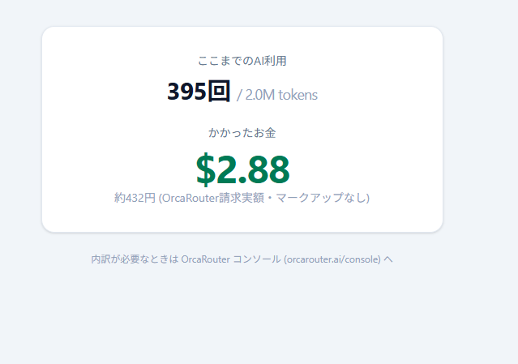

# ChatBan — 会話がそのままタスク管理になる

**AI HACK 2026 提出作品。** かんばんとチャットの二層UIで、タスクの登録・割り振り・完了までを会話で回すタスク管理ツールです。AIは提案するだけ、確定はすべて人間 — human-in-the-loop を割り振り・完了検収・タスク登録の全フローに貫いています。


## コンセプト

- **タスクの新規作成はチャット専用** — UIに作成フォームはありません。「ログイン画面のバグ直さないと」と話すとカードが生えます。スクショやPDFを貼って話すこともできます(原本は保存されず、AIが読んだ意味だけが記録に残る)
- **AIはレコメンドのみ、確定は人間** — 割り振りはAIが負荷と実績を根拠に提案し、人間が承認。完了も「報告→Review→人間の検収チェック」を必ず通り、チャットからDoneへ直行する経路はコードレベルで存在しません
- **Doneは置き場ではなく蒸留装置** — 検収されたタスクは即アーカイブされ、AIが要約カードに蒸留します。却下した(=やらないと決めた)タスクも理由ごと要約に残ります。**89タスクが5行に畳まれます**
- **経緯が残る** — 「なぜそう決めたか」がタスクの経緯メモに貯まり、要約にもチャットの検索にも効きます。経緯欄はどのツールにもありますが、埋まらないのが普通です。埋まるようになったのは、書く手間が消えたことより**必ず読む相手ができた**ことが大きい
- **会話が構造の代わり** — ステータスは固定4列。優先度・タグ・サブタスクはありません。「これ上にして」「#11は#14待ち」と言えば済むものは属性にしない

## こんなことが言えます

```
「未割り当てのタスクをいい感じに振っといて」   → 負荷と実績を根拠に提案 (確定は人間)
「気力がないので軽そうなタスクから並べて」     → 意味で並び替える (キーでは作れない順序)
「なんでDB分けたんだっけ?」                  → 経緯メモを検索して当時の判断を答える
「#12を消して」                             → ゴミ箱へ。「#12を戻して」で復元
「直近なにをしてた?」                        → 実際の更新履歴から要約
```

## コストの話 (審査観点)



**2日間の開発+ドッグフーディングで562回・2.9Mトークン → $3.66。** これは偶然ではなくコスト工学の結果です:

- 対話は `openai/gpt-5.4-mini` を**日付つきIDで固定** + 自動プロンプトキャッシュ (実測85%減)
- ボード状態は「基準スナップショット+差分イベント追記」でプレフィックスを安定させ、キャッシュTTL切れの瞬間に再ベースライン
- 完了はバッチ検収で要約再生成をまとめて1回に
- 品質が肝で非同期の要約は `orcarouter/auto`、定型はコスト優先ルーティング

1ターン0.2〜0.3円・応答0.9〜1.5秒。詳細は [docs/cost-engineering-log.md](docs/cost-engineering-log.md) (8円→0.2円の実測実録)。

**キャッシュを効かせるには2条件がセット**です。「プレフィックスをバイト安定させる」だけでは足りず、「**モデルIDを固定する**」が対になります。キャッシュの実体はそのモデルのKVキャッシュなので、ルーティング先が変われば原理的に全ミスになります。

## 技術スタック

| 層 | 技術 |
|---|---|
| フロント | Vite + React 19 + TypeScript + Tailwind CSS v4 + dnd-kit + Socket.IO |
| バック | Express + better-sqlite3 + OpenAI SDK (→ [OrcaRouter](https://www.orcarouter.ai)) |
| 外部連携 | MCPサーバー内蔵 (Claude Code等からボードを直接操作可能) |
| テスト | Playwright E2E (13件) |

アーキテクチャの全体像は [docs/architecture.md](docs/architecture.md)、コンセプトと現在地は [docs/product-overview.md](docs/product-overview.md)。
AIに何をさせないか (権限境界) と、割り切った部分は [docs/security.md](docs/security.md)。

## 起動方法

前提: Node.js 20+ / OrcaRouter APIキー

```powershell
# APIキー設定 (どちらか)
$env:ORCAROUTER_API_KEY = "sk-orca-..."
# または ~/.orcarouter/apikey.txt に1行で保存

# 依存関係
cd backend; npm install; cd ../frontend; npm install; cd ..

# 起動 (Windows: DBバックアップ+両サーバー+ヘルスチェック)
.\start-dev.ps1

# 手動起動の場合
cd backend; npm run dev    # http://localhost:8787
cd frontend; npm run dev   # http://localhost:5173 (こちらを開く。/api と /socket.io は8787へproxy)
```

データは `backend/data/` に置かれます(プロジェクトごとに1つのSQLiteファイル)。初回起動時に「マイプロジェクト」が1つ作られます。

モデルは**⚙設定タブから実行時に切り替えられます**(再起動不要)。envで既定値を変えることもできます:

- `ORCA_MODEL_MAIN` — 対話・割り振り判断 (default: `openai/gpt-5.4-mini-2026-03-17`)
- `ORCA_MODEL_ARCHIVE` — 要約の要素分解 (default: `orcarouter/auto`)
- `ORCA_MODEL_CHEAP` — 定型処理 (default: `orcarouter/fusion-mini`)
- `ORCA_BASE_URL` — 1行でプロバイダ差し替え (default: `https://www.orcarouter.ai/v1`)

## プロジェクト

プロジェクトごとに**SQLiteファイルが分かれます**。切り替えるとボード・チャット・前提情報・メンバーがまとめて入れ替わり、タスクの番号は各プロジェクトで `#1` から始まります。

- URL `/p/<id>` が表示中のプロジェクトを持つので、**タブごとに別プロジェクトを開けます**。F5しても戻りません
- ⚙設定タブから作成・リネーム・メンバー編集・削除ができます
- メンバーを登録しなければ「**一人用**」として扱われ、割り振り関連の導線が消えます

`project_id` 列ではなくファイルを分けているのは、**#IDが会話の語彙だから**です。「#7を後回し」と口に出せることが手触りに直結するので、番号は2桁で収まってほしい。ついでに「WHERE句の書き忘れで別プロジェクトが混ざる」事故も原理的に起きなくなります。

## テスト

```bash
cd frontend
npm run test:e2e   # Playwright (D&D・検収フロー・プロジェクト分離・ゴミ箱等。LLM呼び出しなし)
```

E2Eは専用ポート(backend:8799 / frontend:5199)と専用データディレクトリ(`e2e-data/`)で動くため、開発サーバーと共存できます。

## MCP連携 (ドッグフーディング)

ChatBan自体の開発タスクは、ChatBanのボードで管理しました。Claude Codeが内蔵MCPサーバー経由でタスクを拾い、実装し、Reviewに置き、人間が検収する — 「作っているツールで、作っているツールのタスクを管理する」構図です。

```json
// .mcp.json — プロジェクトごとにエントリを分けられる
{ "mcpServers": {
  "chatban": { "type": "http", "url": "http://localhost:8787/mcp/1" }
} }
```

**接続URLでプロジェクトが固定される**ので、人間がUIで別プロジェクトに切り替えても、エージェントの書き込み先は変わりません。ツールの引数にプロジェクトIDは出しません(引数が増えるほどLLMは迷うため)。

設計方針として、内蔵チャットは安い定型操作に徹し、横断的な検討・実装はMCP越しの外部エージェント(あなたのClaude)に委ねます。

## 設計判断の記録

このリポジトリは「作った機能」と同じくらい「**作らないと決めた機能**」を大事にしています。カスタムステータス、カテゴリ別チャット、登録承認UI、アプリ内音声入力、**経緯のベクトル検索(RAG)** — いずれも検討の末に理由つきで却下し、その判断自体がDoneの要約カードに蒸留されています。

RAGを入れなかったのは、**この規模では全経緯がコンテキストに収まる**からです。代わりに、LLMが表記ゆれを自分で展開してOR検索するキーワード検索を置きました。「DBを分ける」と「ファイル分離」が近いことを知っているのはLLMなので、意味の近さを外部インデックスに出す必要がありません。

同じ形は並べ替えにも現れます。ソートキーを渡す方式をやめ、**LLMが決めた順番(ID列)** を受け取るようにしたことで、「重要そうな順」「軽そうな順」が表現できるようになりました。書き忘れや重複はコード側で正規化します — **判断はLLM、整合性はコード**。

---

開発実録: 実質2日 (2026-08-09 〜 08-10)。この期間の全コミット・全会話・全LLM呼び出しがこのリポジトリと `backend/data/` に記録されています。📜監査タブの「全ログExport」から一括で取り出せます。
